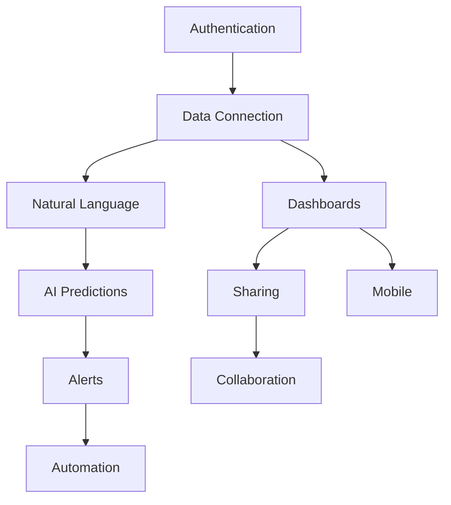

# User Stories & Acceptance Criteria
## SimpleIQ: Making Databricks Accessible to Every Business

---

## Epic Structure

```
📚 Epic 1: User Onboarding & Authentication
📊 Epic 2: Data Connectivity & Management
💬 Epic 3: Natural Language Analytics
📈 Epic 4: Visualization & Dashboards
🤖 Epic 5: AI/ML Predictions
👥 Epic 6: Collaboration & Sharing
🔧 Epic 7: Automation & Workflows
📱 Epic 8: Mobile Experience
🏢 Epic 9: Enterprise Features
🌍 Epic 10: Scaling & Performance
```

---

## 📚 Epic 1: User Onboarding & Authentication

### Story 1.1: User Registration
**As a** small business owner  
**I want to** sign up for SimpleIQ in under 2 minutes  
**So that** I can start analyzing my data immediately without technical hurdles

**Acceptance Criteria:**
```gherkin
Given I am on the SimpleIQ homepage
When I click "Start Free Trial"
Then I should see a simple signup form

Given I am on the signup form
When I enter my email "sarah@boutique.com"
And I enter a password
And I click "Create Account"
Then I should receive a welcome email within 1 minute
And I should be automatically logged in
And I should see the onboarding wizard

Given I just signed up
When I am on the onboarding wizard
Then I should see "Connect Your Data" as the first step
And I should see estimated time "5 minutes" to complete setup
```

**Technical Notes:**
- Implement Auth0/Supabase for authentication
- Password requirements: 8+ characters, 1 number, 1 special character
- Email verification can be async
- Store user timezone on registration

---

### Story 1.2: Google OAuth Integration
**As a** busy entrepreneur  
**I want to** sign up using my Google account  
**So that** I don't need to remember another password

**Acceptance Criteria:**
```gherkin
Given I am on the signup page
When I click "Continue with Google"
Then I should be redirected to Google OAuth

Given I authorize SimpleIQ on Google
When I am redirected back
Then my account should be created automatically
And my name and email should be pre-filled
And I should skip the email verification step
```

**Definition of Done:**
- [ ] OAuth 2.0 implementation complete
- [ ] Handles existing account with same email
- [ ] Profile picture imported from Google
- [ ] Refresh token stored securely
- [ ] Error handling for declined permissions

---

### Story 1.3: Onboarding Wizard
**As a** non-technical user  
**I want to** be guided through initial setup  
**So that** I don't feel lost or overwhelmed

**Acceptance Criteria:**
```gherkin
Given I just created an account
When I land on the dashboard
Then I should see an onboarding wizard overlay

The wizard should have these steps:
1. Welcome & Quick Tour (30 seconds)
2. Connect First Data Source (2 minutes)
3. Ask Your First Question (1 minute)
4. Create Your First Dashboard (2 minutes)
5. Invite Your Team (optional)

Given I am in the onboarding wizard
When I complete each step
Then I should see a progress bar update
And I should earn an achievement badge
And I should be able to skip any step

Given I skip the onboarding
When I want to restart it
Then I should find "Restart Onboarding" in Help menu
```

---

## 📊 Epic 2: Data Connectivity & Management

### Story 2.1: Connect Google Sheets
**As a** small business owner using Google Sheets  
**I want to** connect my spreadsheets with one click  
**So that** I can analyze my existing data without migration

**Context:** *Inspired by how Databricks connects to Delta Lake, but simplified for spreadsheets*

**Acceptance Criteria:**
```gherkin
Given I am on the Data Sources page
When I click "Connect Google Sheets"
Then I should see Google OAuth prompt

Given I authorize access
When I return to SimpleIQ
Then I should see a list of my Google Sheets
And I should be able to search/filter the list

Given I select a spreadsheet
When I click "Connect"
Then I should see a preview of the data
And I should see detected column types
And the data should start syncing immediately

Given my sheet has multiple tabs
When I connect it
Then I should be able to select which tabs to import
And each tab should appear as a separate table
```

**Performance Criteria:**
- Sync 10,000 rows in <30 seconds
- Support sheets up to 1M cells
- Auto-refresh every hour (configurable)
- Handle formula results, not formulas

---

### Story 2.2: CSV File Upload
**As a** user with data in Excel  
**I want to** upload CSV files quickly  
**So that** I can analyze data from any source

**Acceptance Criteria:**
```gherkin
Given I am on the Data Sources page
When I click "Upload CSV"
Then I should see a drag-and-drop zone

Given I drag a CSV file onto the zone
When the file is under 50MB
Then I should see upload progress
And I should see data preview after upload

Given my CSV has inconsistent data
When I upload it
Then I should see data quality warnings
And I should see suggestions to fix issues
And I should be able to proceed anyway

Given I uploaded a CSV
When I want to update it
Then I should be able to upload a new version
And I should see what changed
```

**Validation Rules:**
- Max file size: 50MB (show error if larger)
- Supported encodings: UTF-8, UTF-16, ASCII
- Auto-detect delimiter (comma, tab, pipe)
- Handle quoted fields and escaped characters

---

### Story 2.3: QuickBooks Integration
**As a** small business owner  
**I want to** connect my QuickBooks account  
**So that** I can analyze financial data without manual exports

**Acceptance Criteria:**
```gherkin
Given I am on the Data Sources page
When I click "Connect QuickBooks"
Then I should see QuickBooks OAuth screen

Given I authorize SimpleIQ
When I return to the platform
Then I should see available QuickBooks entities:
  - Customers
  - Invoices  
  - Payments
  - Expenses
  - Products/Services
  - Profit & Loss
  - Balance Sheet

Given I select entities to sync
When I click "Start Sync"
Then I should see sync progress for each entity
And historical data (2 years) should be imported
And new data should sync every hour
```

**Business Logic:**
- Map QuickBooks schema to SimpleIQ schema
- Handle multi-currency properly
- Respect QuickBooks API rate limits
- Store refresh tokens securely

---

## 💬 Epic 3: Natural Language Analytics

### Story 3.1: Ask Questions in Plain English
**As a** non-technical business owner  
**I want to** ask questions about my data in plain English  
**So that** I don't need to learn SQL or technical query languages

**Context:** *This is our key differentiator from Databricks - making queries accessible*

**Acceptance Criteria:**
```gherkin
Given I have connected data sources
When I click on the "Ask" bar
Then I should see example questions like:
  - "What were my sales last month?"
  - "Which products are selling best?"
  - "Show me customer growth over time"

Given I type "What were my total sales in October"
When I press Enter
Then I should see a natural language response:
  "Your total sales in October were $45,230"
And I should see a supporting visualization
And I should see the SQL query (expandable)

Given I ask an ambiguous question like "Show me performance"
When the system needs clarification
Then I should see options:
  - "Sales performance"
  - "Employee performance"  
  - "Product performance"
And I can click to clarify
```

**AI Requirements:**
- Use Llama 3.3 for NL understanding
- Support context from previous questions
- Learn from user corrections
- Response time <3 seconds
- Show confidence score for answers

---

### Story 3.2: Conversational Follow-ups
**As a** user exploring data  
**I want to** ask follow-up questions naturally  
**So that** I can dig deeper into insights

**Acceptance Criteria:**
```gherkin
Given I asked "What were my sales last month"
And I received an answer "$45,230"
When I ask "How does that compare to last year?"
Then the system should understand context
And show "Sales last month were 23% higher than October last year"

Given I'm in a conversation about sales
When I ask "Break that down by product"
Then I should see sales by product for the same time period
And the context should be maintained

Given I want to start over
When I click "New Conversation"
Then the context should reset
But the history should be saved
```

---

### Story 3.3: AI-Generated Insights
**As a** busy business owner  
**I want to** receive automatic insights about my data  
**So that** I discover important patterns I might miss

**Acceptance Criteria:**
```gherkin
Given I log into SimpleIQ
When I view my dashboard
Then I should see an "Insights" section with:
  - "Your sales increased 15% this week"
  - "Unusual spike in returns yesterday"
  - "Top customer hasn't ordered in 30 days"

Given the AI detects an anomaly
When it's significant (>2 standard deviations)
Then I should receive a notification
And I should see an explanation in plain English
And I should see suggested actions

Given I see an insight
When I click "Tell me more"
Then I should see detailed analysis
And I should see contributing factors
And I should be able to ask follow-up questions
```

**ML Requirements:**
- Run anomaly detection daily
- Use time-series forecasting
- Identify trends and patterns
- Personalize insights based on industry
- Confidence threshold >80% for alerts

---

## 📈 Epic 4: Visualization & Dashboards

### Story 4.1: Create First Dashboard
**As a** visual learner  
**I want to** create a dashboard by dragging and dropping  
**So that** I can see my business at a glance

**Acceptance Criteria:**
```gherkin
Given I am on the Dashboards page
When I click "Create Dashboard"
Then I should see a blank canvas with a widget palette

Given I drag a "Sales Metric" widget
When I drop it on the canvas
Then I should see configuration options:
  - Choose metric (revenue, orders, customers)
  - Choose time period
  - Choose comparison (previous period, target)

Given I configured a widget
When I click "Apply"
Then the widget should show real data immediately
And it should auto-refresh every minute
And I should be able to resize it

Given I added 5 widgets
When I click "Save Dashboard"
Then I should name it
And it should appear in my dashboard list
And it should be set as my default view
```

**Widget Types Required:**
- Metric cards (single KPI)
- Line charts (trends)
- Bar charts (comparisons)
- Pie charts (proportions)
- Data tables (details)
- Heat maps (patterns)
- Funnel charts (conversions)

---

### Story 4.2: Use Dashboard Templates
**As a** user who needs guidance  
**I want to** start with pre-built dashboard templates  
**So that** I can get value immediately

**Context:** *Like Databricks solution accelerators, but for SMEs*

**Acceptance Criteria:**
```gherkin
Given I click "Create Dashboard"
When I see the creation options
Then I should see "Start from Template"

Given I choose "Start from Template"
When the gallery opens
Then I should see templates organized by:
  - Industry (Retail, SaaS, Services)
  - Function (Sales, Marketing, Finance)
  - Data Source (QuickBooks, Shopify, etc.)

Given I select "E-commerce Dashboard" template
When I click "Use Template"
Then it should map to my connected data
And show my actual metrics
And I should be able to customize it

Given a template needs data I don't have
When I preview it
Then I should see placeholder data
And I should see what data sources to connect
```

**Required Templates (MVP):**
1. Executive Summary
2. Sales Performance
3. Financial Overview
4. Customer Analytics
5. Marketing Dashboard
6. Inventory Management
7. Employee Performance
8. E-commerce Metrics
9. SaaS Metrics
10. Service Business KPIs

---

## 🤖 Epic 5: AI/ML Predictions

### Story 5.1: Sales Forecasting
**As a** business owner planning inventory  
**I want to** see sales predictions for next month  
**So that** I can order the right amount of stock

**Context:** *Simplified version of Databricks MLflow*

**Acceptance Criteria:**
```gherkin
Given I have 6+ months of sales data
When I click "Predict Future Sales"
Then I should see a forecast for the next 30 days

Given I see the forecast
Then I should see:
  - Predicted daily sales
  - Confidence intervals (80% and 95%)
  - Factors influencing the prediction
  - Comparison to last year (if available)

Given the forecast shows increasing sales
When I hover over the chart
Then I should see explanations like:
  - "Seasonal trend based on last year"
  - "Growth trend continuing"
  - "Holiday impact expected"

Given I want different scenarios
When I click "What-if Analysis"
Then I can adjust variables:
  - Marketing spend
  - Pricing
  - Competitor activity
And see updated predictions
```

**ML Requirements:**
- Use Prophet or similar for time-series
- Incorporate seasonality
- Handle holidays and events
- Min 6 months historical data
- Update predictions daily
- Explain predictions in plain English

---

### Story 5.2: Churn Prediction
**As a** subscription business owner  
**I want to** know which customers might cancel  
**So that** I can take preventive action

**Acceptance Criteria:**
```gherkin
Given I have customer subscription data
When I view the Customers dashboard
Then I should see a "Churn Risk" indicator

Given a customer is marked "High Risk"
When I click for details
Then I should see:
  - Churn probability (e.g., 78%)
  - Contributing factors:
    * Decreased usage (-40%)
    * Support tickets increased
    * Failed payment last month
  - Recommended actions:
    * Send personalized offer
    * Schedule check-in call
    * Review recent issues

Given I want to see all at-risk customers
When I click "View All At-Risk"
Then I should see a sorted list
And I should be able to export it
And I should see aggregate statistics
```

---

## 👥 Epic 6: Collaboration & Sharing

### Story 6.1: Invite Team Members
**As a** business owner  
**I want to** invite my team to view dashboards  
**So that** everyone can make data-driven decisions

**Acceptance Criteria:**
```gherkin
Given I am on a dashboard
When I click "Share"
Then I should see sharing options:
  - Invite by email
  - Copy link
  - Embed code

Given I invite "manager@company.com"
When I set their permission to "View Only"
Then they should receive an invitation email
And they can view but not edit
And I should see them in the access list

Given I share a public link
When someone accesses it
Then they should see the dashboard
But not see sensitive menu options
And I can revoke the link anytime
```

**Permission Levels:**
- Owner: Full control
- Editor: Can edit, not delete
- Viewer: Read-only access
- Commenter: Can view and comment

---

### Story 6.2: Comments and Annotations
**As a** team member  
**I want to** comment on data points  
**So that** we can discuss insights in context

**Acceptance Criteria:**
```gherkin
Given I'm viewing a dashboard
When I right-click on a data point
Then I should see "Add Comment"

Given I add a comment "Why did this spike happen?"
When I save it
Then it should appear as a small icon
And other users should see it
And they should get notified

Given someone replies to my comment
When I log in
Then I should see a notification
And I can continue the thread
And the discussion is saved with the data
```

---

## 🔧 Epic 7: Automation & Workflows

### Story 7.1: Scheduled Reports
**As a** busy executive  
**I want to** receive reports automatically  
**So that** I stay informed without logging in

**Acceptance Criteria:**
```gherkin
Given I have a dashboard I check daily
When I click "Schedule Report"
Then I should see scheduling options:
  - Frequency (daily, weekly, monthly)
  - Time (with timezone)
  - Recipients (multiple emails)
  - Format (PDF, Excel, or link)

Given I schedule a daily report at 9 AM
When 9 AM arrives
Then recipients should receive an email
With the dashboard as PDF attachment
And key metrics in the email body

Given metrics changed significantly
When the report is sent
Then it should highlight changes:
  - "Sales up 23% from yesterday"
  - "New customer record: 45"
  - "Inventory alert: Widget X low"
```

---

### Story 7.2: Smart Alerts
**As a** operations manager  
**I want to** get alerts when something needs attention  
**So that** I can respond quickly to issues

**Acceptance Criteria:**
```gherkin
Given I'm setting up an alert
When I click "Create Alert"
Then I can choose conditions:
  - Metric crosses threshold
  - Unusual pattern detected
  - Goal achieved/missed
  - Data not updated

Given I set "Sales < $1000/day" alert
When daily sales drop below $1000
Then I should receive:
  - Email notification
  - SMS (if configured)
  - In-app notification
  - Slack message (if connected)

Given an alert triggers
When I receive the notification
Then it should include:
  - What triggered it
  - Current value vs threshold
  - Link to dashboard
  - Suggested actions
```

---

## 📱 Epic 8: Mobile Experience

### Story 8.1: Mobile Dashboard Viewing
**As a** business owner on the go  
**I want to** check my dashboards on my phone  
**So that** I can stay informed anywhere

**Acceptance Criteria:**
```gherkin
Given I open SimpleIQ on my phone
When I log in
Then I should see mobile-optimized dashboards

Given I'm viewing a dashboard
When I rotate my phone
Then charts should resize appropriately
And data should remain readable

Given I want to interact with a chart
When I tap on it
Then I should see detailed view
And I can pinch to zoom
And swipe to see more data

Given I have multiple dashboards
When I swipe left/right
Then I should navigate between them
And see dots indicating position
```

**Mobile Requirements:**
- Support iOS 14+ and Android 10+
- Offline mode for cached data
- Touch gestures for interaction
- Responsive design breakpoints
- Max 2 second load time on 4G

---

## 🏢 Epic 9: Enterprise Features

### Story 9.1: Single Sign-On (SSO)
**As an** IT administrator  
**I want to** use our company's SSO  
**So that** users have one password and better security

**Context:** *Moving upmarket like Databricks*

**Acceptance Criteria:**
```gherkin
Given I'm an admin
When I go to Settings > Security
Then I should see "Configure SSO"

Given I configure Okta SSO
When I enter our Okta domain
Then SimpleIQ should:
  - Validate the configuration
  - Test the connection
  - Map user attributes
  - Show success confirmation

Given SSO is enabled
When users visit SimpleIQ
Then they should:
  - See "Login with Company SSO"
  - Be redirected to Okta
  - Auto-provision on first login
  - Inherit Okta groups as roles
```

**SSO Support Required:**
- SAML 2.0
- OAuth 2.0 / OIDC
- Okta
- Azure AD
- Google Workspace
- Custom SAML

---

### Story 9.2: Advanced Security & Compliance
**As a** compliance officer  
**I want to** ensure data handling meets regulations  
**So that** we remain compliant with GDPR/CCPA

**Acceptance Criteria:**
```gherkin
Given I need audit trails
When I go to Security > Audit Logs
Then I should see:
  - All data access events
  - Configuration changes
  - User actions
  - API calls
  - Export capability

Given GDPR requirements
When a user requests data deletion
Then I should be able to:
  - Export all their data
  - Delete all their data
  - Provide deletion certificate
  - Complete within 30 days

Given I need data residency
When I configure SimpleIQ
Then I can choose:
  - US data centers
  - EU data centers
  - APAC data centers
And data never leaves the region
```

---

## 🌍 Epic 10: Scaling & Performance

### Story 10.1: Handle Business Growth
**As a** growing business  
**I want** SimpleIQ to scale with me  
**So that** I don't need to switch platforms as I grow

**Context:** *Unlike Databricks, we auto-scale without configuration*

**Acceptance Criteria:**
```gherkin
Given my data grows from 10GB to 1TB
When I continue using SimpleIQ
Then performance should remain consistent:
  - Dashboard load <2 seconds
  - Queries complete <5 seconds
  - No manual optimization needed

Given I grow from 5 to 500 users
When they access simultaneously
Then the system should:
  - Auto-scale infrastructure
  - Maintain response times
  - Show no degradation
  - Handle concurrent edits

Given I hit plan limits
When I need more capacity
Then I should:
  - See clear upgrade prompts
  - Upgrade with one click
  - Keep all my data/settings
  - No downtime during upgrade
```

**Performance SLAs:**
- 99.9% uptime
- <200ms API response (p50)
- <1s API response (p99)
- <2s dashboard load
- <5s complex queries
- Auto-scale in <60 seconds

---

## 📊 User Story Prioritization Matrix

### MoSCoW Prioritization

#### Must Have (MVP)
1. User registration and authentication
2. Google Sheets connectivity
3. CSV upload
4. Basic natural language queries
5. 5 chart types
6. Dashboard creation
7. Basic sharing

#### Should Have (Phase 1)
1. QuickBooks integration
2. Sales forecasting
3. Team collaboration
4. Scheduled reports
5. Mobile viewing
6. Dashboard templates
7. Google OAuth

#### Could Have (Phase 2)
1. SSO support
2. Advanced AI predictions
3. Custom alerts
4. API access
5. White labeling
6. Audit logs
7. Multiple languages

#### Won't Have (Future)
1. On-premise deployment
2. Custom ML models
3. Blockchain integration
4. VR/AR dashboards
5. Quantum encryption

---

## 🎯 Success Metrics per Story

### Measurement Framework

| Story | Success Metric | Target | Measurement |
|-------|---------------|--------|-------------|
| Registration | Completion rate | >80% | Analytics |
| First data connection | Success rate | >90% | System logs |
| First query | Satisfaction | >4.5/5 | In-app survey |
| Dashboard creation | Time to complete | <5 min | Analytics |
| Team invite | Acceptance rate | >70% | Email tracking |
| Forecast accuracy | MAPE | <15% | Backtesting |
| Mobile usage | DAU on mobile | >30% | Analytics |
| Alert relevance | Action rate | >50% | Click tracking |

---

## 🔄 Story Dependencies



---

## ✅ Global Definition of Done

Every story must meet these criteria:

### Development
- [ ] Code complete and functioning
- [ ] Unit tests written (>80% coverage)
- [ ] Integration tests passing
- [ ] Code reviewed by 2 developers
- [ ] No critical bugs
- [ ] Performance benchmarks met

### Product
- [ ] Acceptance criteria verified
- [ ] Product owner approved
- [ ] UX review passed
- [ ] Works on all supported browsers
- [ ] Mobile responsive (where applicable)
- [ ] Accessibility standards met (WCAG 2.1 AA)

### Documentation
- [ ] API documentation updated
- [ ] User help docs written
- [ ] Release notes prepared
- [ ] Internal wiki updated

### Deployment
- [ ] Deployed to staging
- [ ] QA sign-off received
- [ ] Deployed to production
- [ ] Feature flag configured
- [ ] Monitoring alerts set up
- [ ] Rollback plan tested

---

## 📝 Story Template

```markdown
### Story X.X: [Title]
**As a** [user type]
**I want to** [action]
**So that** [benefit]

**Context:** [Optional: Business context or comparison to Databricks]

**Acceptance Criteria:**
- Given [context]
- When [action]
- Then [expected result]

**Technical Notes:**
- [Implementation details]
- [API considerations]
- [Performance requirements]

**Design Notes:**
- [UI/UX requirements]
- [Mockup links]

**Dependencies:**
- [Required stories]
- [Technical dependencies]

**Story Points:** [1, 2, 3, 5, 8, 13, 20]
**Priority:** [P0, P1, P2]
**Sprint:** [Target sprint]
```

---

*"Every story brings us closer to democratizing data analytics for SMEs."*